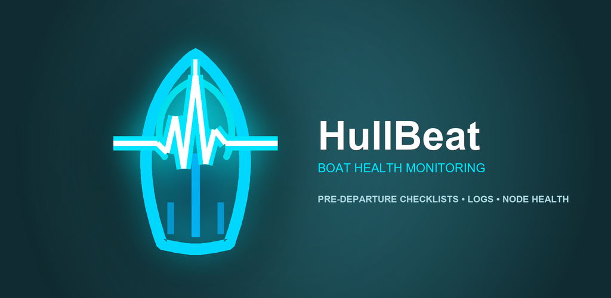
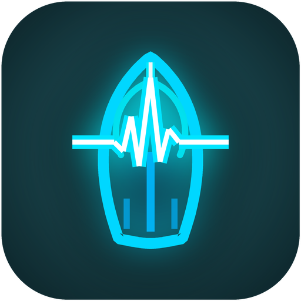

<p align="center">
  
</p>

<p align="center">
  
</p>

<h1 align="center">HullBeat — Судновий журнал та обслуговування</h1>

<p align="center">
  <strong>Надійний, приватний та на 100% офлайн помічник для власників катерів і яхт.</strong>
</p>

<p align="center">
  
  
  
  
  
</p>

---

## 🌊 Що це таке простими словами?

Коли у вас є катер чи яхта, дуже легко забути:
- Коли востаннє міняли оливу в двигуні?
- Чи пора міняти цинкові аноди або крильчатку помпи (імпелер)?
- Скільки запасних фільтрів залишилося і в якому рундуку вони лежать?
- Скільки годин відпрацював двигун цього сезону?

**HullBeat** — це кишеньковий бортовий журнал, який пам'ятає все за вас. Він автоматично підраховує мотогодини та календарні дні, заздалегідь нагадує про регламентні роботи і показує реальний стан судна на одному екрані.

---

## 🛡️ Головна перевага: 100% офлайн та приватність

* **Працює будь-де:** у відкритому морі, на якорі або в марині, де немає жодного зв'язку.
* **Жодних серверів і хмар:** всі записи, фотографії та списки зберігаються **лише на вашому телефоні**.
* **Жодного відстеження:** додаток не збирає аналітику і навіть не вимагає дозволу на інтернет (дозвіл на інтернет повністю відсутній у коді).

---

## ✨ Ключові можливості

1. **Головний екран «Пульс» (Now):**
   * Миттєвий статус: що треба зробити просто зараз, що прострочено, а що підходить за строком.
   * Передрейсовий чекліст безпеки перед виходом на воду.

2. **Розумний розрахунок регламентів:**
   * Сервісні інтервали рахуються так, як це дійсно працює на флоті: за мотогодинами двигуна, за датою або за тим, що настане раніше (наприклад, кожні 100 мотогодин або раз на рік).

3. **Паспорти вузлів та обладнання:**
   * Готовий structured каталог суднових систем: головний двигун, редуктор, помпа, вітрила, такелаж, електрика, корпус, аноди тощо.
   * Зручне зберігання маркувань, серійних номерів та специфікацій деталей.

4. **Журнал обслуговування з фото:**
   * Історія кожної заміни оливи, ремонту чи діагностики.
   * Можливість прикріпити фото лічильника чи стану деталі з переглядом у повний екран.
   * Фіксація витрат на деталі, пальне та послуги сервісу.

5. **Судновий склад запасних частин:**
   * Облік запасу фільтрів, ременів, свічок і запобіжників із зазначенням конкретного місця зберігання на борту (наприклад: *«Рундук лівого борту»* або *«Штурманський стіл»*).
   * Попередження про вичерпання запасів перед тривалим переходом.

6. **Експорт у PDF та Excel:**
   * Формування повного паспорта обслуговування судна в один клік — ідеально для звіту страховій компанії або для покупця при продажу судна.

7. **Зручний інтерфейс для моря (56+ dp):**
   * Великі кнопки, які зручно натискати навіть мокрими пальцями або в рукавичках на хвилі.

---

## 🚀 Як зібрати та запустити проєкт

### Вимоги:
* **JDK:** 17 або 21
* **Android Studio:** версія Ladybug (2024.2.1) або новіша
* **Мінімальна версія Android:** Android 8.0 (API 26)
* **Цільова версія Android:** Android 15 (API 35)

### Кроки запуску:

1. **Клонуйте репозиторій:**
   ```bash
   git clone https://github.com/Rigged-mind/hull_beat.git
   cd hull_beat
   ```

2. **Збірка через термінал:**
   * **Windows (PowerShell):**
     ```powershell
     .\gradlew.bat assembleDebug
     ```
   * **Linux / macOS:**
     ```bash
     ./gradlew assembleDebug
     ```

3. **Запуск тестів:**
   ```powershell
   .\gradlew.bat testDebugUnitTest
   ```

4. **Або відкрийте проєкт в Android Studio:**
   * Натисніть **Open** та оберіть папку проєкту `hull_beat`.
   * Дочекайтеся завершення Gradle Sync.
   * Натисніть кнопку **Run** (`Shift + F10`) на емуляторі або підключеному смартфоні.

---

## 📁 Структура проєкту

```
hull_beat/
├── app/                  # Основний Android-додаток (Jetpack Compose, Room, Kotlin)
│   ├── src/main/java/    # Вихідний код: UI, ViewModels, база даних, логіка
│   └── src/test/         # Модульні юніт-тести бізнес-логіки
├── catalog/              # Базова база знань: типи вузлів, чеклісти, синоніми (UK/EN)
├── design/               # Дизайн-система: векторні логотипи, палітри кольорів, графіка
├── docs/                 # Повна технічна документація та специфікації
├── tools/                # Скрипти валідації якості, лінтери та кодогенератори (Python)
├── template/             # Еталонний файл імпорту/експорту Excel (.xlsx)
└── prototype/            # Інтерактивний HTML5-прототип для швидкого тестування інтерфейсу
```

---

## 📄 Ліцензія та автори

* **Автор:** Vladyslav Kravchenko ([@Rigged-mind](https://github.com/Rigged-mind))
* **Email:** [riggedmind2049@gmail.com](mailto:riggedmind2049@gmail.com)
