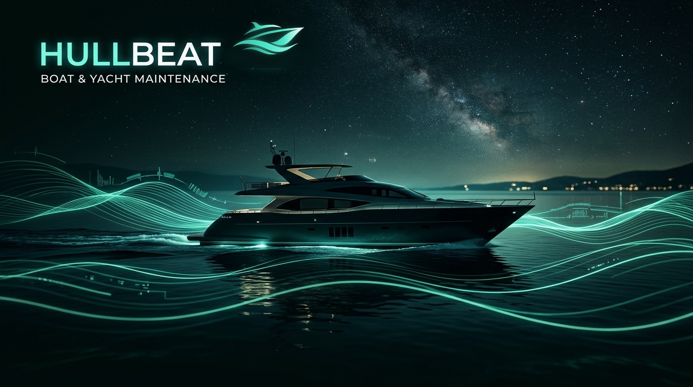
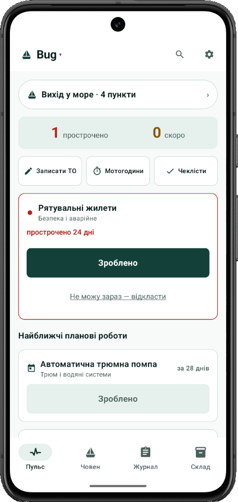
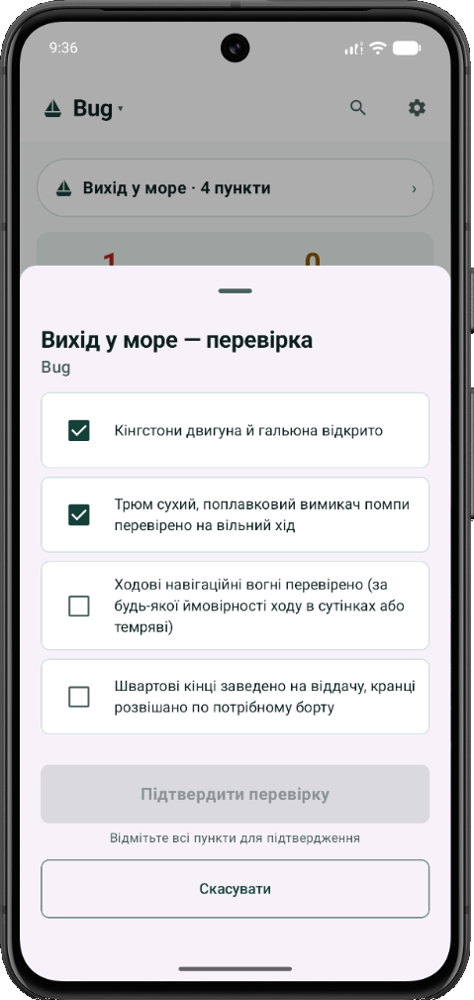
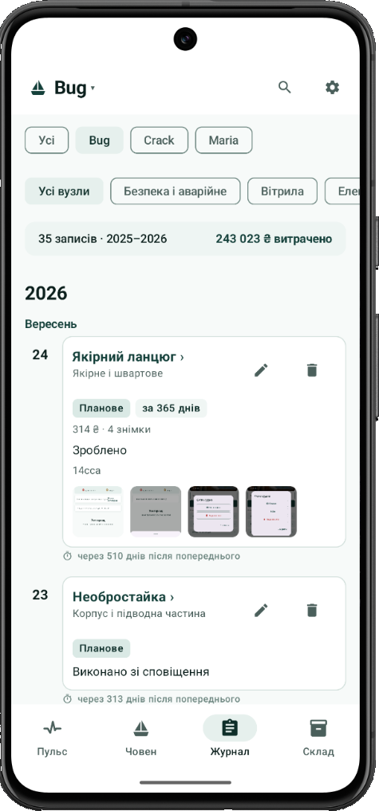
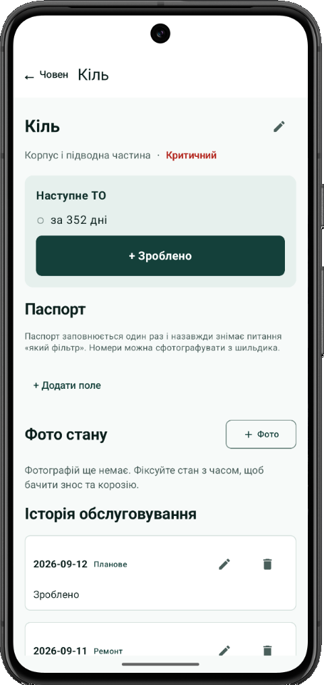
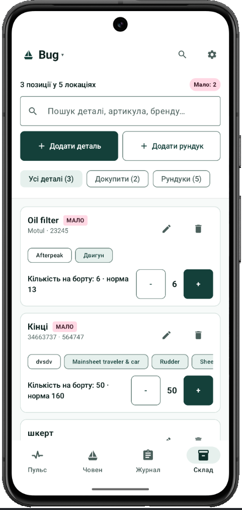

<p align="center">
  
</p>

<p align="center">
  <picture>
    <source media="(prefers-color-scheme: dark)" srcset="design/logo/app-icon-lockup-dark.svg">
    <source media="(prefers-color-scheme: light)" srcset="design/logo/app-icon-lockup-light.svg">
    
  </picture>
</p>

<p align="center">
  <strong>⚓ HullBeat для Android — Офлайн судновий журнал та планувальник технічного обслуговування катерів і яхт</strong><br>
  <strong>⚓ HullBeat for Android — Offline Boat Maintenance Logbook & Service Planner for Sail and Motor Vessels</strong>
</p>

<p align="center">
  
  
  
  
  
</p>

<p align="center">
  <a href="#-українська">🇺🇦 Українська версія</a> &nbsp;•&nbsp; <a href="#-english">🇬🇧 English version</a>
</p>

---

# 🇺🇦 Українська

## 🌊 Що таке HullBeat простими словами?

Володіння катером чи яхтою — це не лише романтика моря, а й постійний догляд за сотнею деталей і систем. На воді дуже легко щось упустити:
* Чи пора замінити цинкові аноди на корпусі та сейлдвайві, щоб метал не з'їла електрохімічна корозія?
* Скільки років стоїть стоячий такелаж, чи в нормі ванти й штаги, і коли востаннє змащували палубні лебідки?
* У якому стані донно-забортні крани (кінгстони) та крильчатка помпи (імпелер)?
* Коли востаннє міняли оливу в двигуні та редукторі?
* Де саме на борту лежить запасний паливний фільтр і скільки їх залишилося в рундуку?

**HullBeat** — це кишеньковий автономний Android-застосунок, цифровий боцман і судновий журнал. Він об'єднує всі вузли судна в одну наочну систему, автоматично веде підрахунок мотогодин або днів і заздалегідь попереджає капітана про необхідні регламентні роботи.

---

## ⚓ Створено капітаном для себе (З власного морського досвіду)

> **HullBeat народився не в офісі, а на воді — у реальних переходах, на стоянках і під час ремонтів.**  
> Автор розробляв цей застосунок **в першу чергу під себе і для свого судна**. Це відповідь на реальний щоденний головний біль: незручні розрізнені таблиці Excel, хмарні додатки, які вимагають платних підписок і стають безпорадними щойно у морі зникає зв'язок, та дрібні кнопки на екрані, в які неможливо влучити мокрими пальцями на хвилі. 
> 
> Тут усе зроблено так, щоб капітану було **максимально зручно і просто**: без зайвої бюрократії, з великими кнопками під руку в рукавичці та логікою, перевіреною на власному досвіді.

---

## 🛡️ Головні переваги

1. **100% Офлайн та абсолютна приватність:**
   * Працює будь-де: у відкритому морі, на віддаленому якорі чи в марині без інтернету.
   * Жодних хмар, акаунтів чи серверів — усі ваші записи, документи та фотографії зберігаються **виключно на вашому телефоні**.
   * Додаток повністю позбавлений дозволу на вихід в інтернет (`INTERNET permission`).

2. **Зручний імпорт та експорт історії обслуговування:**
   * **Гнучкий імпорт:** Швидке перенесення ваших наявних записів із таблиць Excel (.xlsx) або CSV. Розумний аналізатор (`ColumnMapper` / `CsvSniffer`) автоматично розпізнає стовпчики, формати дат і чистить дані при переході.
   * **Друк та експорт:** Створення повного суднового паспорта та хронології обслуговування у форматі **Excel** або **PDF** в один клік — незамінно для страхових компаній, сервісних центрів чи для підтвердження вартості при продажу судна.

3. **Додавання зображень та фотофіксація:**
   * Можливість прикріпити фотографії до будь-якої сервісної роботи, огляду вузла чи поломки.
   * Фотофіксація лічильників мотогодин для підтвердження показників.
   * Зручний повнорозмірний переглядач із підтримкою жестів свайпу (гортання), зумом, лічильником знімків та підписами.

---

## ✨ Ключові можливості

### 1. Головний розділ «Пульс» (Now)
«Пульс» — це оперативний командний місток вашого судна, де зібрано все найважливіше:
* **Статус судна в реальному часі:** миттєвий огляд стану — кількість прострочених (`1 прострочено`) та наближених (`0 скоро`) регламентних робіт.
* **Швидкі дії:** кнопки швидкого доступу прямо під статусом (`Записати ТО`, `Мотогодини`, `Чеклісти`).
* **Пріоритет критичності:** системи безпеки та життєзабезпечення (рятувальні жилети, кінгстони, помпа) завжди автоматично піднімаються на самий верх списку.
* **Швидкий запис у 2 дотики:** кнопка дії прямо на картці (`Зроблено`).
* **Механізм обґрунтованого відкладення робіт (Defer):** опція *«Не можу зараз — відкласти»* (тимчасово глушить нагадування на переході, зберігаючи факт прострочення для чесної історії).
* **Стрічка найближчих планових робіт:** календарний графік завдань із зазначенням терміну (наприклад, *«Автоматична трюмна помпа — за 28 днів»*).

<p align="center">
  
</p>

### 2. Передрейсові чеклісти безпеки (Pre-departure Checklists)
Швидка та надійна перевірка готовності судна перед виходом у море:
* **Капітанський протокол перевірки:** перевірка кінгстонів двигуна й гальюна, сухості трюму та вільного ходу поплавкового вимикача помпи, ходових навігаційних вогнів, швартових кінців та кранців.
* **Захист від випадкового старту:** кнопка підтвердження перевірки активується лише тоді, коли відмічено всі обов'язкові пункти безпеки.

<p align="center">
  
</p>

### 3. Судновий журнал робіт та фотофіксація (Journal)
Повна безперервна історія життя та сервісу вашого судна:
* **Хронологічна стрічка робіт:** структурований запис планових ТО, ремонтів та інспекцій із зазначенням дати, напрацювання мотогодин і витрат.
* **Фотофіксація дефектів та оглядів:** можливість прикріплення фотографій деталей, лічильників та зносу безпосередньо до кожного запису (наприклад, 4 знімки до маркування та огляду якірного ланцюга).
* **Облік витрат за сезон:** швидкий підсумок кількості робіт та загальної суми витрат за сезони (наприклад, *«35 записів · 2025–2026 · 243 023 ₴ витрачено»*).
* **Розумна фільтрація:** миттєвий відбір за судном (*«Bug»*, *«Crack»*, *«Maria»*) або категоріями (*«Безпека і аварійне»*, *«Вітрила»*, *«Електроніка»*).
* **Контроль інтервалів:** автоматичний підрахунок днів, що минули після попереднього обслуговування.

<p align="center">
  
</p>

### 4. Паспорт вузлів та технічний стан (Vessel & Components)
* **Повний паспорт обладнання:** фіксація характеристик вузлів, серійних номерів та артикулів розхідників, щоб назавжди зняти питання «який саме фільтр сюди підходить». Номери та параметри можна сфотографувати прямо з шильдика.
* **Моніторинг зносу та корозії:** фотофіксація стану вузла з часом для відстеження корозії, стану гелькоуту або пера керма.
* **Повне охоплення систем судна:** корпус, кіль, перо керма, підводна частина, такелаж, вітрила, якірне обладнання, електроніка та дизелі.

<p align="center">
  
</p>

### 5. Судновий склад запасних частин та рундуки (Store)
* **Облік кількості деталей:** точний облік запасних фільтрів, кінців, крильчаток забортних помп та ременів.
* **Точна прив'язка до суднових локацій:** розподіл деталей за рундуками (*«Afterpeak»*, *«Двигун»*, *«Рундук лівого борту»*).
* **Швидке коригування залишків:** кнопки `[-]` та `[+]` прямо на картці деталі для зміни кількості в один дотик.
* **Попередження про критичний залишок:** мітка `МАЛО` (наприклад, коли на борту 6 шт. при нормі 13), що сигналізує про необхідність докупити розхідники перед виходом.
* **Швидкий пошук:** миттєвий пошук за назвою деталі, брендом (*Motul*) або артикулом.

<p align="center">
  
</p>

### 6. Зручний інтерфейс для моря
* **Цілі дотику від 56 dp:** великі кнопки та комфортні проміжки, якими легко керувати мокрими пальцями або в цупких яхтових рукавичках під час хитавиці.
* **Тема для нічної навігації (Night Navigation):** спеціальна глибока червоно-бурштинова палітра на ультратемному тлі, яка зберігає природну адаптацію очей рульового до темряви на нічній вахті й не засліплює місток.
* **Режим «Яскраве сонце» (Sunlight Mode):** підвищений контраст 7:1 із посиленими межами для впевненого читання з екрана під прямим сонцем на відкритій палубі.

---

## 🚀 Як зібрати та запустити проєкт

### Системні вимоги:
* **JDK:** 17 або 21
* **Android Studio:** Ladybug (2024.2.1) або новіша
* **Мінімальна версія Android:** Android 8.0 (API 26)
* **Цільова версія Android:** Android 15 (API 35)

### Швидкий старт:
```powershell
# 1. Клонувати репозиторій
git clone https://github.com/Rigged-mind/HullBeat.git
cd HullBeat

# 2. Збірка APK через термінал
.\gradlew.bat assembleDebug

# 3. Запуск модульних тестів
.\gradlew.bat testDebugUnitTest
```

---

<br>

# 🇬🇧 English

## 🌊 What is HullBeat in Plain Words?

Owning a boat or yacht is rewarding, but keeping every system seaworthy demands constant vigilance. At sea, dozens of critical items compete for your attention:
* When were the sacrificial zinc anodes on the hull and saildrive last replaced to prevent galvanic corrosion?
* What is the true age and tension of the standing rigging, shrouds, and stays? When were the cockpit winches last serviced?
* Are the seacocks, through-hulls, and the raw-water pump impeller in trustworthy condition?
* When was the engine and gearbox oil last changed?
* Exactly which locker holds the spare fuel filter, and how many are left aboard?

**HullBeat** is a standalone offline Android application, digital boatswain and boat maintenance logbook. It brings every vessel system into one coherent, actionable overview, tracks service intervals by engine hours and calendar days, and keeps your boat voyage-ready at all times.

---

## ⚓ Built by a Sailor, for Sailors (Born from Real Experience)

> **HullBeat was not designed in an office — it was forged out on the water, through real passages, anchorages, and shipyard refits.**  
> The author built this app **first and foremost for himself and his own boat**. It is the direct answer to personal frustration with messy spreadsheets, subscription-heavy cloud apps that stop working the minute you lose cellular coverage offshore, and fiddly small buttons impossible to hit with wet hands or heavy sailing gloves while pitching in a seaway.
> 
> Everything here is designed around what is **genuinely convenient and practical for a skipper**: zero friction, oversized touch targets, and a workflow tested by real nautical experience.

---

## 🛡️ Key Advantages

1. **100% Offline & Absolute Privacy:**
   * Works offshore, at anchor, or in remote marinas with zero cellular reception.
   * Zero cloud dependence, zero tracking, no sign-ups — all vessel records and photos stay **exclusively on your physical device**.
   * Completely lacks the Android `INTERNET` permission.

2. **Seamless Maintenance Import & Export:**
   * **Intelligent Import:** Effortlessly migrate existing maintenance logs from Excel (.xlsx) or CSV. The built-in `ColumnMapper` and `CsvSniffer` automatically map columns and clean date formats.
   * **PDF & Excel Export:** Generate comprehensive vessel passports and dated maintenance histories in **Excel** or **PDF** format with one tap — essential for insurance renewals, surveyors, or proving vessel care upon resale.

3. **Full Photo Documentation & Inspection:**
   * Attach high-resolution photos to any service record, component card, or defect report.
   * Photo logging for engine hour meters to verify readings.
   * Full-screen gallery viewer featuring intuitive swipe gestures, zoom, photo counter, and custom captions.

---

## ✨ Comprehensive Features

### 1. The "Pulse" (Now) Command Center
The central dashboard designed for immediate situational awareness:
* **Live Vessel Readiness:** Instant status showing overdue tasks, upcoming maintenance, and systems in good standing.
* **Safety Ranking:** Mission-critical items (raw-water impellers, seacocks, engine oil, bilge pumps) automatically float to the top of the list.
* **Quick 2-Tap Logging:** Tap action buttons directly on the card (`Done`, `Renewed`, `Record`, `Check`). The dynamic bottom sheet requests **only the specific fields needed** to clear the item (e.g., hour reading for engine items; new mandatory expiry date for life rafts, pyrotechnics, and documentation).
* **Legitimate Deferrals (Defer):** "Cannot do now — defer" option (e.g., defer until winter haul-out or for 30 days). Suppresses nagging alerts during a voyage while retaining the overdue fact in the permanent log.
* **Pre-Departure Safety Checklist:** Quick inspection protocol before slipping lines (hatches secured, bilge status, fuel level, bilge pumps verified, navigation lights tested, life jackets accessible).
* **Multi-Vessel Support:** Switch between your cruising boat, tender, or dinghy in seconds.

<p align="center">
  
</p>

### 2. Pre-Departure Safety Checklists
Rigorous, rapid pre-voyage safety verification before slipping lines:
* **Skipper's Inspection Protocol:** Engine & marine head seacocks verified open, bilge dry and pump float switch checked for free travel, navigation lights tested, mooring lines set and fenders rigged.
* **Departure Verification Guard:** The confirmation button unlocks only when all mission-critical safety checklist items are inspected and checked.

<p align="center">
  
</p>

### 3. Maintenance Journal, Photo Documentation & Costs (Journal)
Continuous, tamper-proof history of your vessel's upkeep:
* **Chronological Service Timeline:** Clean log of scheduled maintenance, refits, repairs, and inspections with dates, engine hour marks, and parts used.
* **Photo Proof & Defect Logging:** Attach multiple photos of parts, wear patterns, hour meters, and surveyor inspections directly to each log entry (e.g. 4 photos attached to anchor chain service).
* **Seasonal Cost & Expense Tracking:** Overview of total service spend and breakdown across jobs to keep track of maintenance budgets (e.g. *«35 records · 2025–2026 · 243,023 ₴ spent»*).
* **Smart Filtering:** Filter entries instantly by vessel (*«Bug»*, *«Crack»*, *«Maria»*) or system categories (*«Safety & Emergency»*, *«Sails»*, *«Electrical»*).
* **Interval Tracking:** Automatic calculation of days elapsed since the prior service event.

<p align="center">
  
</p>

### 4. Component Passport & Technical History (Vessel)
* **Comprehensive Equipment Passport:** Permanent record of component specs, serial numbers, part numbers, and nameplate photos to eliminate guesswork when ordering spares.
* **Wear & Corrosion Visual Tracking:** Photo logging over time to track keel condition, gelcoat crazing, rudder stock play, or cathodic wear.
* **Full Systems Coverage:** Keel, rudder, hull, through-hulls, standing and running rigging, sails, ground tackle, electronics, and propulsion.

<p align="center">
  
</p>

### 5. On-board Spare Parts & Locker Inventory (Store)
* **Track Spare Parts Stock:** Monitor stock levels of mission-critical consumables (fuel and oil filters, rigging lines, raw-water impellers, alternator belts).
* **Precise Locker Assignments:** Logical boat locker mapping (*"Afterpeak"*, *"Engine compartment"*, *"Port salon locker"*).
* **Quick Stock Stepper:** Dedicated `[-]` and `[+]` buttons right on the component card for instant count adjustments.
* **Low Stock Alerts:** Prominent `LOW` badge (e.g. when 6 items remain aboard against a recommended minimum of 13) to prevent sailing short of essential spares.
* **Fast Search:** Instant lookup by part name, brand (*Motul*), or OEM part number.

<p align="center">
  
</p>

### 6. Marine-Optimized User Interface
* **Touch Targets ≥ 56 dp:** Engineered for challenging conditions at sea — oversized touch targets and generous spacing ensure reliable operation with wet hands or heavy sailing gloves while pitching.
* **Night Navigation Theme:** Deep red-amber palette on an ultra-dark background designed to preserve night vision at the helm during night passages.
* **Sunlight Mode:** High-contrast 7:1 ratio with reinforced borders for direct midday sun reading on an open cockpit display.

---

## 🚀 Build & Run

```bash
# Clone repository
git clone https://github.com/Rigged-mind/HullBeat.git
cd HullBeat

# Assemble debug APK
./gradlew assembleDebug

# Run unit tests
./gradlew testDebugUnitTest
```

---

## 📁 Repository Structure

```
HullBeat/
├── app/                  # Main Android application (Jetpack Compose, Room, Kotlin)
│   ├── src/main/java/    # Clean architecture: UI, ViewModels, Database, Importer/Exporter
│   └── src/test/         # Unit tests covering engines, calculations, and parsers
├── catalog/              # Preloaded marine component ontology, checklists, and synonyms
├── design/               # Design system: vector logos, palette tokens, store assets, banner
├── docs/                 # Complete architecture, UI guidelines, and engineering specs
├── tools/                # Python verification suites, linters, and palette generators
├── template/             # Canonical Excel reference template (.xlsx)
└── prototype/            # Interactive HTML5 prototype for offline UI testing
```

---

## 📄 Author & License

* **Author:** Vladyslav Kravchenko ([@Rigged-mind](https://github.com/Rigged-mind))
* **Email:** [riggedmind2049@gmail.com](mailto:riggedmind2049@gmail.com)
